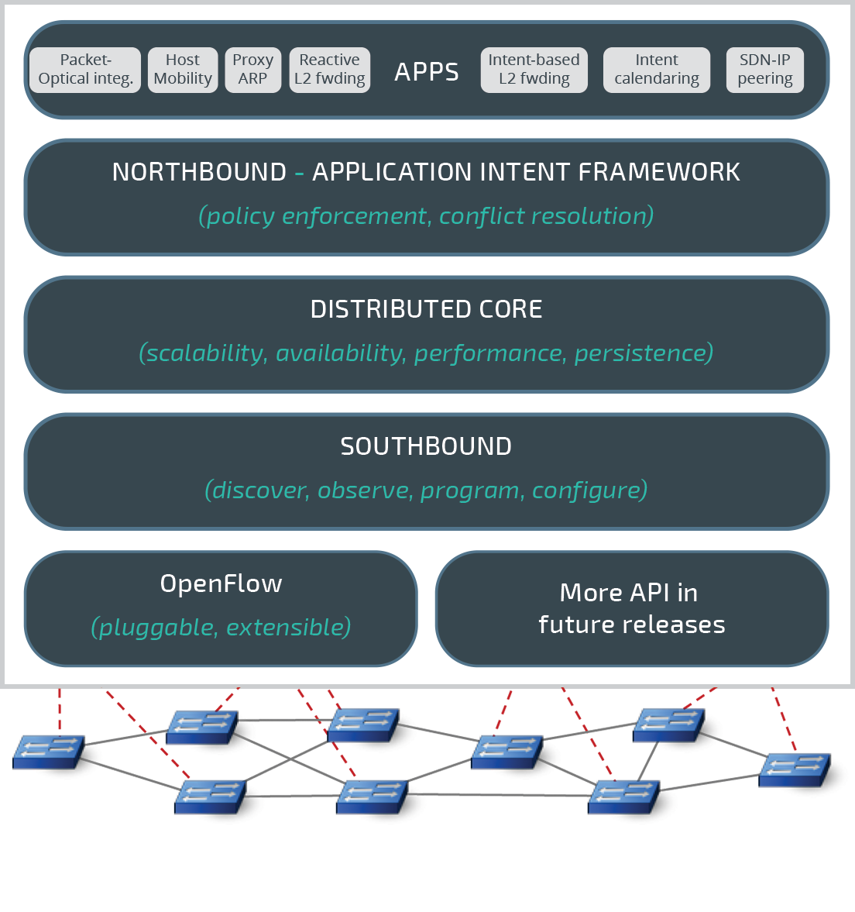
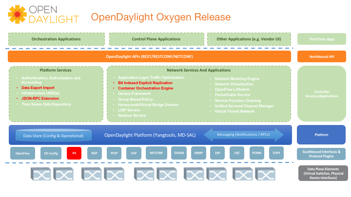
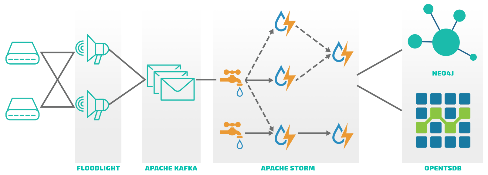
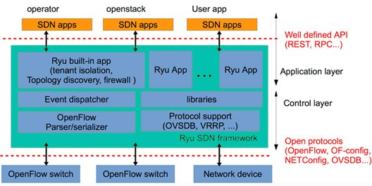
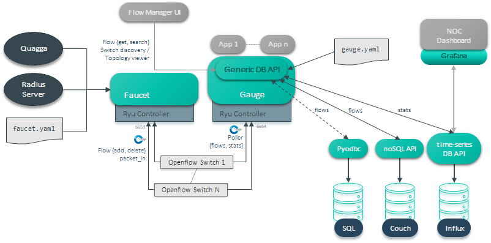
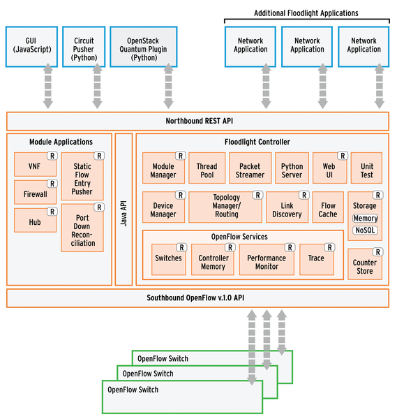

# SDN controllerek összahasonlítása

## 1. Onos

### Cél

* brown field &rarr; green field
* georedundancia
* ISP-knek kifejezetten
* SD-WAN
* **JAVA**

### Modularitás

* eszközök ki/be csatlakoztatása, miközben fut a kontroller

### Skálázhatóság

* Vízszintes skálázhatóságra tervezték
* Atomix datastore konzisztenciát biztosít controllerek között
* Hamar leterhelődik, sok hostot nem bír el
* natív BGP

### Interfészek

* Déli: OpenFlow, P4, NETCONF, TL1, SNMP, BGP, RESTCONF and PCEP
* Északi: gRPC, RESTful APIs
* Van GUI
* Intent based framework
* YANG

### Hiba tolerancia

* Egyszerű cluster kezelés
* HA átállás

### Support

* Linux Foundation Networking

## 2. Opendaylight

## Cél

* SD-LAN
* Felhő integráció
* Nagy skálázhatóság és automatizáció
* **JAVA**

### Modularitás

* OSGi conténerek felhasználása
* flexibilis nagyon

### Skálázhatóság

* In-memory hálózat tárolás
* Multi-site deployment
* Natív BGP

### Interfészek

* Déli: OpenFlow, P4, NETCONF, SNMP, BGP, RESTCONF and PCEP
* Északi: gRPC, RESTful API

### Hiba tolerancia

* Clusteren belüli hiba tolerancia (fájl szintű)

### Support

* Linux Foundation Networking

## 3. OpenKilda

## Cél

* Kis latency
* Skálázható data & control plane
* end-to-end telemetria
* Floodlight
* Telemetria
* **JAVA**

### Modularitás

* Decentralizált
* Cluster agentek

### Skálázhatóság

* Vízszintes szétosztás intenzív műveleteknél
* Idempotens Floodlight instance-ok
* Apache is skálázható
* nincs BGP

### Interfészek

* Déli: Openflow
* Északi: RESTful API

### Hiba tolerancia

* Nincs beépített mechanizmus, külső eszközökkel meg lehet valósítani

### Support

* Fejlesztésben ezért nincs rá kapacitás

## 4. Ryu

## Cél

* Component based toolbox
* Jól definiált API-k, új hálózatok létrehozására
* **Python**

### Modularitás

* A felhasználónak kell megírnia a hálózatot amit szeretne és a kódót futtatja &rarr; nagy flexibilitás

### Skálázhatóság

* Külső eszközök lehetővé teszik új instance felhúzását pl.: Zookeeper
* Nincs cooperative cluster

### Interfészek

* Déli: OpenFlow, NETCONF, OF-Config...
* Északi: RESTful API

### Hiba tolerancia

Fentebb kifejtve

### Support

* Community

## 5. Faucet

## Cél

* Ryu-ra épülő/jellegű
* Fentebbi absztrakciós szintekbe viszi a hálózati forgalmak kezelését
* **Python**

### Modularitás

* Jól definiált API-k

### Skálázhatóság

* Konténerizációs alapokon van, ezért visszavezethető arra szintre is, de akár bare-metal
* Idempotens cluster-ek
* Zookeeper
* Nincs cooperatív cluster support

### Interfészek

* Déli: Openflow, VLANs, IPv4, IPv6, static and BGP routing, port mirroring, policy-based forwarding and ACLs matching
* Északi: YAML konfigurációs fájlok &rarr; CI/CD
* Prometheus support

### Hiba tolerancia

* Gyors restart

### Support

* Community

## 6. Floodlight

* Python
* Build and run
* Legtöbbet használt, legelterjedtebb
* **JAVA**

Kb ugyanaz, mint az ODL

## Support

* Big Switch Networks